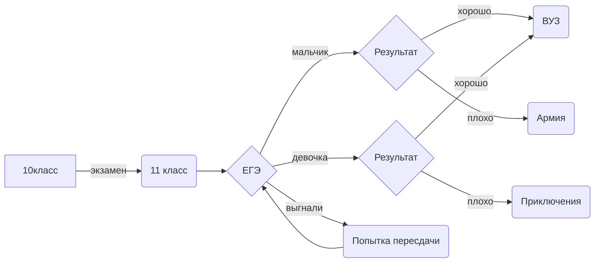

# ARS2022
Arseniy Prokhorov  
*Имеются*  
  -Морзе.ру    
  -Перевод в n-ичную систему счисления.py  
  -Морзе Эксель  .xlsx
  -Число Фиббоначи Эксель  .xlsx
  -Перевод n-ичную систему счисления Эксель .xlsx
  -PDF  .pdf
  -Таблица умножения Эксель и py  
  -Перевод из n-ичной системы .py
  -Логика ТАБЛИЦА 1 .xlsx 
   Питон файл с 5 функциями:морзе,хэмминг,таблица умножения,перевод из и в 10 систему  
  -PYTHON BULALG.py 
  
 

$$A \vee (A \wedge B)$$  

$$sin(\alpha-\beta)=sin\alpha cos\beta -sin\beta cos\alpha$$ 

$$tg(\alpha -\beta)=\frac{tg\alpha-tg\beta}{1+tg\alpha tg\beta}$$ 

$$cos2\alpha = cos^{2}-sin^{2}=2cos^{2}-1=1-2sin^{2}$$ 
 
$$\bar{\mathrm{E}_{1}^{2}}=\sqrt{\frac{F a^{x-1}}{(x-1)x}}+\mathrm{\alpha}_{1}^{\frac{1}{3}}+\mathrm{\beta}_{2}^{\frac{2}{3}}$$  
QUIZ.py - викторина  

